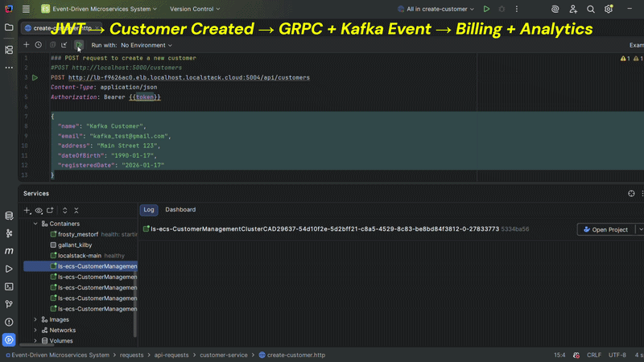

# Event-Driven Microservices System

An end-to-end **Java / Spring Boot** project that demonstrates a realistic **event-driven microservices architecture** with **JWT auth**, **gRPC**, **Kafka**, **API Gateway**, **Docker**, and **AWS Infrastructure as Code** - deployed locally using **LocalStack**.

---

## Demo (GIF)



**End-to-end flow:**  
JWT → Customer Created → gRPC call → Kafka event → Billing + Analytics

📹 **Full demo video (MP4):** `docs/demo.mp4`  
(You can download it directly from the repository.)

---

## Architecture

This system is composed of multiple microservices communicating via **synchronous gRPC** and **asynchronous Kafka events**, behind an **API Gateway**, and secured with **JWT**.

**Services**
- **customer-service**: REST API for customer CRUD + Kafka producer + gRPC client
- **billing-service**: gRPC server that handles billing-related actions
- **analytics-service**: Kafka consumer for customer events
- **auth-service (identity)**: login + JWT validation (Spring Security)
- **api-gateway**: single entry point, routes requests to services
- **infrastructure**: CloudFormation templates to deploy the stack on LocalStack

---

## Tech Stack

**Backend**
- Java, Spring Boot
- Spring Security (JWT)
- gRPC + Protobuf
- Kafka (MSK on LocalStack)

**Platform**
- Docker / Docker Compose
- API Gateway (Spring Cloud routing)
- OpenAPI / Swagger
- Integration tests

**Infrastructure**
- AWS LocalStack
- CloudFormation
- ECS, RDS, MSK, ALB (emulated locally)

---

## Key Features

- **JWT Authentication**
    - `/login` issues a token
    - `/validate` verifies JWT tokens

- **Customer API**
    - `GET /customers`
    - `POST /customers`
    - `POST /customers/{id}` (update)
    - `DELETE /customers/{id}`

- **gRPC Customer → Billing**
    - Customer creation triggers a sync gRPC request to Billing

- **Kafka Event-Driven Analytics**
    - Customer service publishes a `CUSTOMER_CREATED` event
    - Analytics service consumes and processes it

- **Production-style local deployment**
    - Infrastructure defined using CloudFormation
    - Deployed locally with LocalStack (ECS/RDS/MSK/ALB)

---

## Repository Microservices Structure

```text
.
├─ api-gateway/
├─ auth-service/
├─ customer-service/
├─ billing-service/
├─ analytics-service/
├─ infrastructure/
├─ integration-tests/
└─ docs/
   ├─ demo.gif
   └─ demo.mp4
```

---

## Running Locally

### Prerequisites
- **Highly Recommended:** IntellijIdea Ultimate
- Java 21+
- Docker + Docker Compose
- LocalStack Desktop (recommended)
- AWS CLI (configured for LocalStack)
- Maven

> This project is designed to run locally using **LocalStack** to emulate AWS services.

### Quick Start (Local)

#### 1) Build services, databases and Kafka images

**Build each microservice image** (run this inside each service directory):

```bash
docker build -t <service-name>:latest .
```

- Recommended image names (example):
```bash
# From ./customer-service
docker build -t customer-service:latest .

# From ./billing-service
docker build -t billing-service:latest .

# From ./analytics-service
docker build -t analytics-service:latest .

# From ./auth-service
docker build -t auth-service:latest .

# From ./api-gateway
docker build -t api-gateway:latest .
```

**Pull the Postgres image** (used for the service databases):
```bash
docker pull postgres:latest
```

**Pull the Kafka image** (broker/runtime image):
```bash
docker pull ubuntu/kafka:latest
```

- **Tip:** you can verify images with the following command:
```bash
docker images
```

#### 2) Start LocalStack
- Open **LocalStack Desktop** and start it

#### 3) Deploy infrastructure (CloudFormation)
From the `infrastructure/` directory, deploy the stack running the following command:
```bash
./localstack-deploy.sh
```

#### 4) Verify end-to-end

To test the complete flow, you can use the pre-configured `.http` files located in the `/requests` directory. These are compatible with the IntelliJ HTTP Client or the REST Client extension for VS Code.

1. **Obtain JWT (Login)**
   Execute the request found in `requests/api-requests/auth-service/login.http`. This will retrieve the token required for all protected services.

2. **LocalStack Endpoint:** ??? - refers to your personal LocalStack url. (Note: The script within the file automatically saves the token to the {{token}} global variable).

   ```http
   POST [http://lb-???.elb.localhost.localstack.cloud:5004/auth/login]
   Content-Type: application/json

   {
     "email": "test@gmail.com",
     "password": "password123"
   }
   ```

3. **Create a Customer** (Full Flow): Use the file `requests/api-requests/customer-service/create-customer.http`. Ensure your request includes the Authorization header:

    ``` bash
   Authorization: Bearer {{token}}
    ```

4. **Confirm the Flow in Logs**
   After creating a customer, verify the following steps in your terminal or Docker console:
   - [x] HTTP 200/201 response from the API Gateway.
   - [x] **Sync Communication**: Check `billing-service` logs to see the gRPC call creating the billing account.
   - [x] **Async Event**: Check `analytics-service` logs to confirm the consumption of the `CUSTOMER_CREATED` Kafka event.

---

## API Documentation (Swagger)

- **Customer Service API**: available via Swagger/OpenAPI
- **Identity (Auth) Service API**: available via Swagger/OpenAPI

---

## Testing

Integration tests cover:

- Login + JWT issuance
- Unauthorized access checks
- Protected customer endpoints

Run integration tests from the `integration-tests/` module:
```bash
cd integration-tests
mvn test
```

---

## What I Learned

- Designing service boundaries and integration patterns (sync gRPC vs async Kafka)
- Implementing security flows with JWT + Spring Security
- Building an event-driven pipeline with Kafka producers/consumers
- Reproducible deployments using CloudFormation + LocalStack
- Writing meaningful integration tests for backend APIs

---

## Notes

This project uses **LocalStack** to emulate AWS services locally.

For a real AWS deployment, the same architecture principles apply, but you'll need real AWS networking, IAM, and managed services configuration.

---